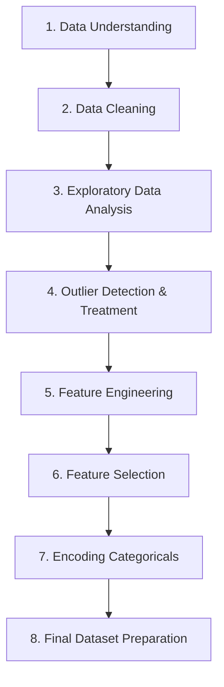

# Project 01 - E-Commerce Data Cleaning & Preprocessing

---

## Project Overview

This project was completed as part of the **Decode Labs Data Science Internship Program**. 

The main objective is to perform end-to-end data cleaning, preprocessing, exploratory data analysis (EDA), outlier treatment, feature engineering, and final dataset preparation on an e-commerce transaction dataset. This prepares the data for robust downstream machine learning models.

---

## Dataset Information

The raw dataset contains transaction records from an e-commerce platform.

* **Total Rows:** 1,200
* **Total Columns:** 14

### Features Schema

| Column Name | Data Type | Description |
| :--- | :--- | :--- |
| `OrderID` | Nominal / Categorical | Unique identifier for each order |
| `Date` | DateTime | Timestamp of the transaction |
| `CustomerID` | Nominal / Categorical | Unique identifier for each customer |
| `Product` | Categorical | Product category or name |
| `Quantity` | Numerical (Integer) | Quantity of items purchased |
| `UnitPrice` | Numerical (Float) | Unit price of the product |
| `ShippingAddress` | Text | Customer shipping address details |
| `PaymentMethod` | Categorical | Method of payment used (e.g., Credit Card, PayPal, etc.) |
| `OrderStatus` | Categorical | Status of the order (e.g., Delivered, Shipped, Cancelled) |
| `TrackingNumber` | Text | Courier tracking number for the order |
| `ItemsInCart` | Numerical (Integer) | Number of distinct items in the cart |
| `CouponCode` | Categorical / Text | Promotional coupon code applied |
| `ReferralSource` | Categorical | Channels driving the customer (e.g., Search, Social Media) |
| `TotalPrice` | Numerical (Float) | Total cost of the order (Quantity $\times$ UnitPrice) |

---

## Project Workflow

### 1. Data Understanding
* **Loading & Structure Analysis:** Inspected the shape, columns, features, and native data types.
* **Basic Statistics:** Generated descriptive statistics to look for anomalies, range scales, and initial properties.

### 2. Data Cleaning
* **Missing Value Analysis:** Identified missing data distributions across all columns.
* **Imputation/Treatment:** Handled nulls in `CouponCode`, `TrackingNumber`, and other fields dynamically based on logical defaults (e.g., "None" for missing coupon codes).
* **Duplicates:** Checked and resolved duplicate rows to ensure clean transaction integrity.

### 3. Exploratory Data Analysis (EDA)
* **Univariate Analysis:** Analyzed distributions and skewness using histplots, boxplots, and countplots.
* **Bivariate & Multivariate Analysis:** Evaluated interactions between customer metrics, product sales, and revenue.
* **Key Visualizations:**
  * Distribution plots of numerical attributes (`TotalPrice`, `Quantity`, `UnitPrice`).
  * Correlation heatmaps to identify strong linear relationships.
  * Revenue breakdown by `Product` category, `PaymentMethod`, and `ReferralSource`.

### 4. Outlier Detection & Treatment
* Compared statistical detection techniques:
  * **IQR Method:** Identified values outside the $[Q_1 - 1.5 \times IQR, Q_3 + 1.5 \times IQR]$ range.
  * **Z-Score Method:** Identified values exceeding $\pm3$ standard deviations from the mean.
* **Capping:** Handled outliers in numerical fields using IQR threshold capping to preserve data size while reducing extreme skewness.

### 5. Feature Engineering
Created rich new features to capture higher-level behavioral trends:
* `CouponUsed`: Binary flag (`1` or `0`) indicating whether a customer redeemed a discount.
* `PricePerItem`: Derived actual unit price calculated directly.
* `OrderMonth` & `OrderYear`: Extracted from the `Date` timestamp for temporal trend analysis.
* `AverageCartValue`: Estimated average item cost within the transaction.

### 6. Feature Selection
Dropped metadata and high-cardinality ID columns that do not contribute predictive power for machine learning:
* `OrderID`, `CustomerID`, `ShippingAddress`, `TrackingNumber`, `Date`

### 7. Encoding
Converted categorical string features to numerical representations:
* **Label Encoding:** Applied to `ReferralSource` to handle ordinal/ordered categories.
* **One-Hot Encoding (OHE):** Applied to `Product`, `PaymentMethod`, `OrderStatus`, and `CouponCode` to avoid ranking assumptions in nominal data.

### 8. Final Dataset Preparation
* Concatenated engineered numerical attributes with encoded categorical vectors.
* Saved the final processed data to `Cleaned_Dataset.csv`.

---

## Technologies Used

* **Language:** Python 3.8+
* **Data Manipulation:** Pandas, NumPy
* **Visualization:** Matplotlib, Seaborn
* **Preprocessing:** Scikit-Learn (LabelEncoder, OneHotEncoder)
* **IDE:** Jupyter Notebook

---

## Project Deliverables

All project deliverables are stored in the `Project-01` directory:

1. [`Dataset.csv`](file:///Users/shivampatidar/Downloads/DecodeLabs-Internship/Project-01/Dataset.csv) - Raw transaction dataset.
2. [`Cleaned_Dataset.csv`](file:///Users/shivampatidar/Downloads/DecodeLabs-Internship/Project-01/Cleaned_Dataset.csv) - Preprocessed and encoded dataset ready for ML models.
3. [`Project_01.ipynb`](file:///Users/shivampatidar/Downloads/DecodeLabs-Internship/Project-01/Project_01.ipynb) - Documented Jupyter Notebook detailing code and analysis.

---

## Key Learning Outcomes

* Implementing robust pipeline structures for cleaning noisy e-commerce transactions.
* Advanced outlier identification using IQR/Z-score and capping strategies.
* Encoding complex categorical inputs using Mixed Encoding techniques (One-Hot vs. Label encoding).
* Deriving value-added features from DateTime and text elements.

---

## Author

**Shivam Patidar**  
*Decode Labs Data Science Intern*
