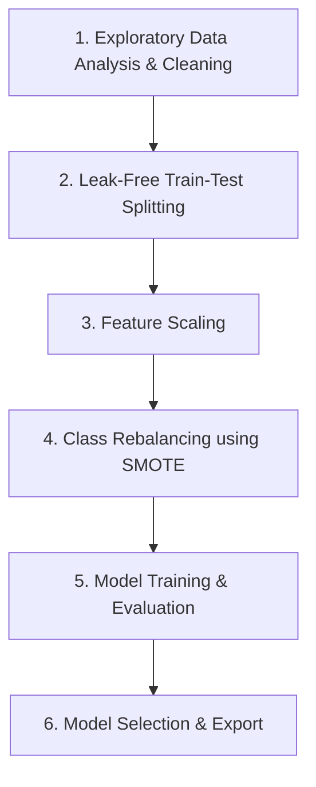

# Project 02 - Supervised Learning (Fraud Detection)

---

## Project Overview

This project was completed as part of the **Decode Labs Data Science Internship Program**. 

The main objective is to build a classification system to predict whether a credit card holder will default on their payment next month. Using demographic details, billing history, and repayment statuses of credit card clients in Taiwan, we built a machine learning pipeline that handles class imbalance and evaluates performance using metrics suited for risk prediction (like ROC-AUC and Recall).

---

## Dataset Information

The dataset used is the **Default of Credit Card Clients Dataset** containing transaction details of 30,000 clients.

* **Total Rows:** 30,000
* **Total Columns:** 25

### Features Schema

| Column Name | Data Type | Description |
| :--- | :--- | :--- |
| `ID` | Numerical (Integer) | Unique identifier for each client |
| `LIMIT_BAL` | Numerical (Float) | Amount of the given credit (NT dollar) |
| `SEX` | Categorical (Integer) | Gender (1 = male; 2 = female) |
| `EDUCATION` | Categorical (Integer) | Education level (1 = graduate school; 2 = university; 3 = high school; 0, 4, 5, 6 = others) |
| `MARRIAGE` | Categorical (Integer) | Marital status (1 = married; 2 = single; 3 = divorce; 0 = others) |
| `AGE` | Numerical (Integer) | Age in years |
| `PAY_0` to `PAY_6` | Categorical (Integer) | Repayment status from September 2005 to April 2005 (-2 = no consumption; -1 = paid in full; 0 = use of revolving credit; 1-9 = payment delay in months) |
| `BILL_AMT1` to `BILL_AMT6` | Numerical (Float) | Amount of bill statement (NT dollar) from September 2005 to April 2005 |
| `PAY_AMT1` to `PAY_AMT6` | Numerical (Float) | Amount of previous payment (NT dollar) from September 2005 to April 2005 |
| `default.payment.next.month` | Binary (Integer) | Target Variable (1 = default; 0 = no default) |

---

## Project Workflow

### 1. Exploratory Data Analysis & Cleaning
* **Class Imbalance:** Discovered that approximately 77.88% (23,364 clients) paid on time, whereas 22.12% (6,636 clients) defaulted.
* **Missing Value Check:** Determined there are 0 missing/null values across the dataset.
* **Visualization:** Plotted countplots of defaults to visual class imbalance and distribution patterns.

### 2. Leak-Free Train-Test Splitting
* **Split Ratio:** Split the 30,000 rows into 80% training data (24,000 records) and 20% testing data (6,000 records).
* **Anti-Leakage Strategy:** The test set was strictly separated before any preprocessing (such as scaling or resampling) to guarantee evaluation is unbiased.

### 3. Feature Scaling
* Applied `StandardScaler` to bring all numerical variables onto a uniform scale.
* Fitted the scaler *only* on the training features (`X_train`) and transformed both training and testing datasets.

### 4. Class Rebalancing using SMOTE
* To prevent the machine learning models from favoring the majority class, **Synthetic Minority Over-sampling Technique (SMOTE)** was applied to the training dataset.
* This oversamples the default class synthetically, resulting in a perfectly balanced training dataset.

### 5. Model Training & Evaluation
Two models were trained and compared:
* **Logistic Regression:** A baseline model using standard L2 regularization.
* **Random Forest Classifier:** An ensemble tree-based method using 100 estimators.

---

## Model Evaluation & Performance

Evaluating the classifiers on the unseen test dataset yielded the following results:

| Model | Accuracy | ROC-AUC | F1-Score (Default Class) | Recall (Default Class) | Precision (Default Class) |
| :--- | :--- | :--- | :--- | :--- | :--- |
| **Logistic Regression** | 67.00% | 0.7104 | 0.46 | **63.00%** | 36.00% |
| **Random Forest Classifier** | **79.00%** | **0.7464** | **0.49** | 46.00% | **54.00%** |

### Key Findings
* **Random Forest** achieved the highest overall accuracy (79.00%) and ROC-AUC score (0.7464), proving to be the best overall predictor.
* **Logistic Regression** had a higher recall for defaults (63.00%), which means it caught more potential defaulters, but at the cost of many false positives (only 36.00% precision).

---

## Technologies Used

* **Language:** Python 3.8+
* **Data Manipulation:** Pandas, NumPy
* **Visualization:** Matplotlib, Seaborn
* **Oversampling:** Imbalanced-learn (SMOTE)
* **Machine Learning:** Scikit-Learn
* **Serialization:** Pickle

---

## Project Deliverables

All deliverables are stored in the `Project-02` directory:

1. [`UCI_Credit_Card.csv`](file:///Users/shivampatidar/Downloads/DecodeLabs-Internship/Project-02/UCI_Credit_Card.csv) - Raw credit card clients dataset.
2. [`Project-02.ipynb`](file:///Users/shivampatidar/Downloads/DecodeLabs-Internship/Project-02/Project-02.ipynb) - Jupyter Notebook with the fully documented pipeline.
3. [`credit_default_best_model.pkl`](file:///Users/shivampatidar/Downloads/DecodeLabs-Internship/Project-02/credit_default_best_model.pkl) - Saved Random Forest model.
4. [`credit_default_scaler.pkl`](file:///Users/shivampatidar/Downloads/DecodeLabs-Internship/Project-02/credit_default_scaler.pkl) - Saved StandardScaler instance for scaling future inputs.

---

## Key Learning Outcomes

* Implementing structured and leak-free machine learning pipelines.
* Using synthetic oversampling (SMOTE) to tackle class imbalances.
* Interpreting business-critical trade-offs between precision and recall in risk modeling.
* Saving models and preprocessors for deployment and real-time inference.

---

## Author

**Shivam Patidar**  
*Decode Labs Data Science Intern*
